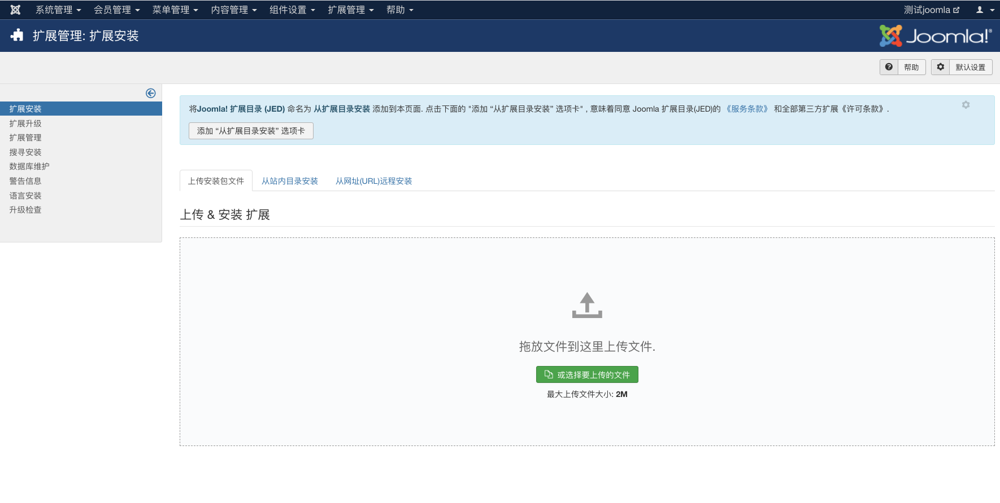
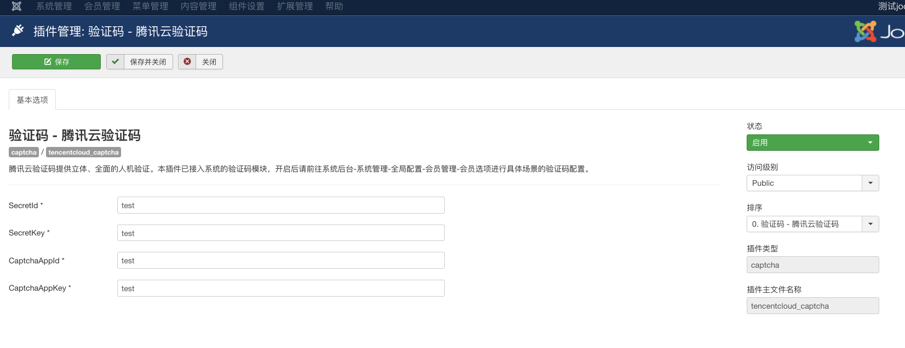
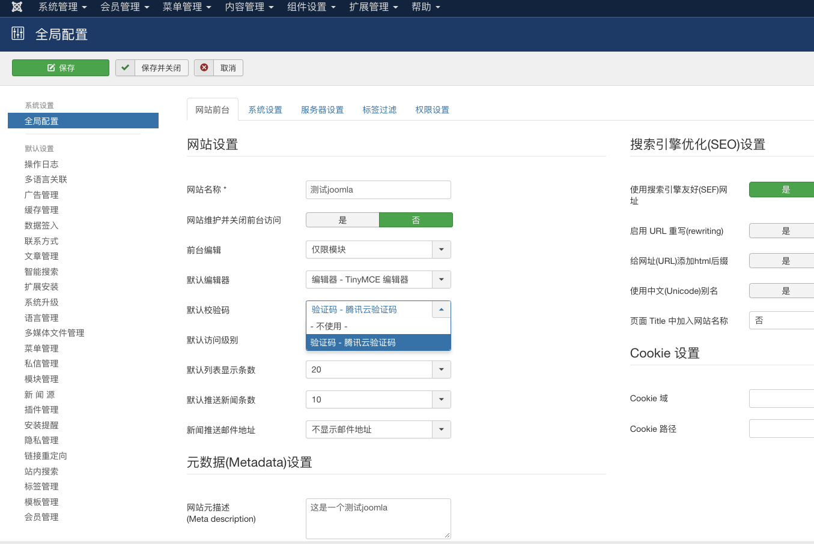
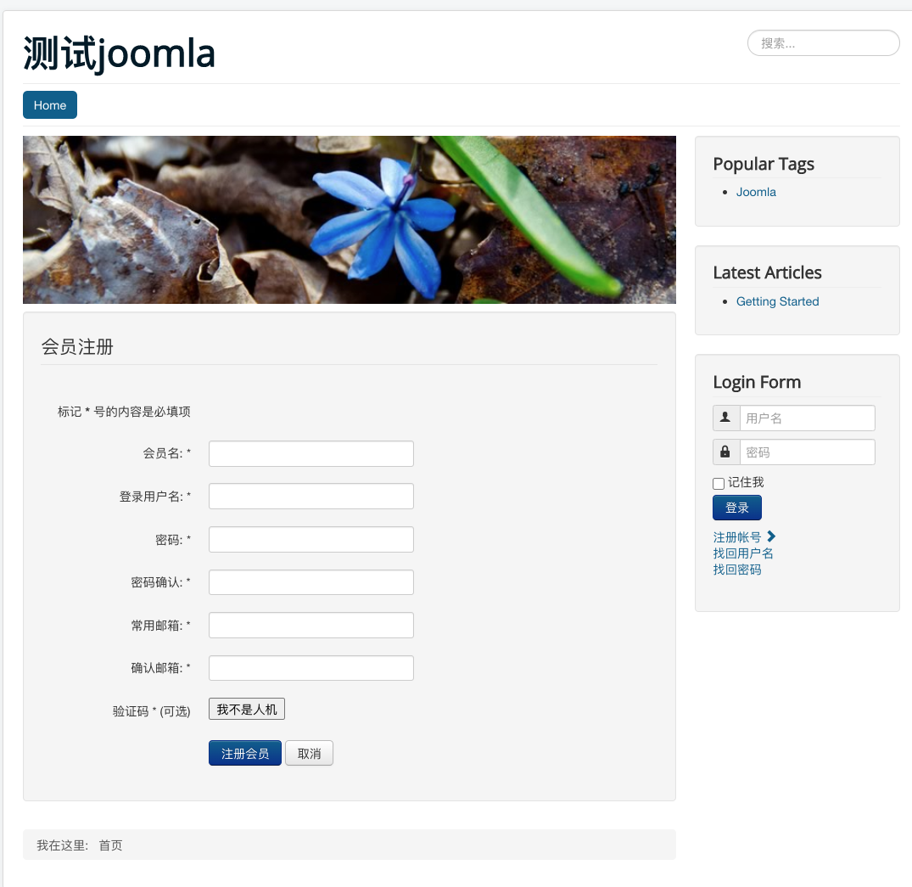
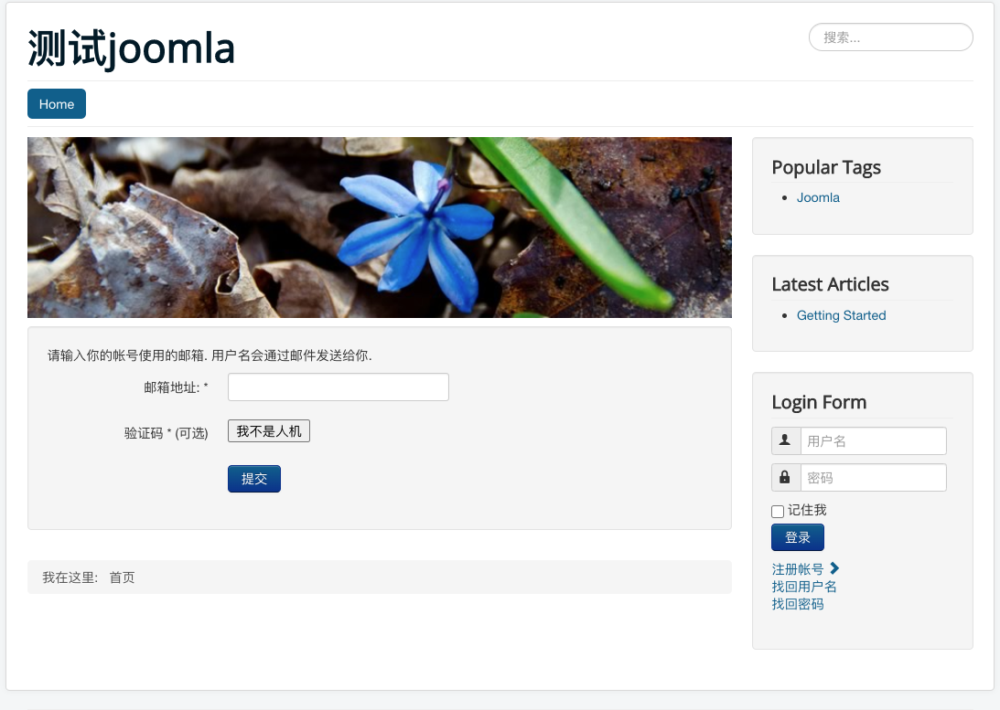
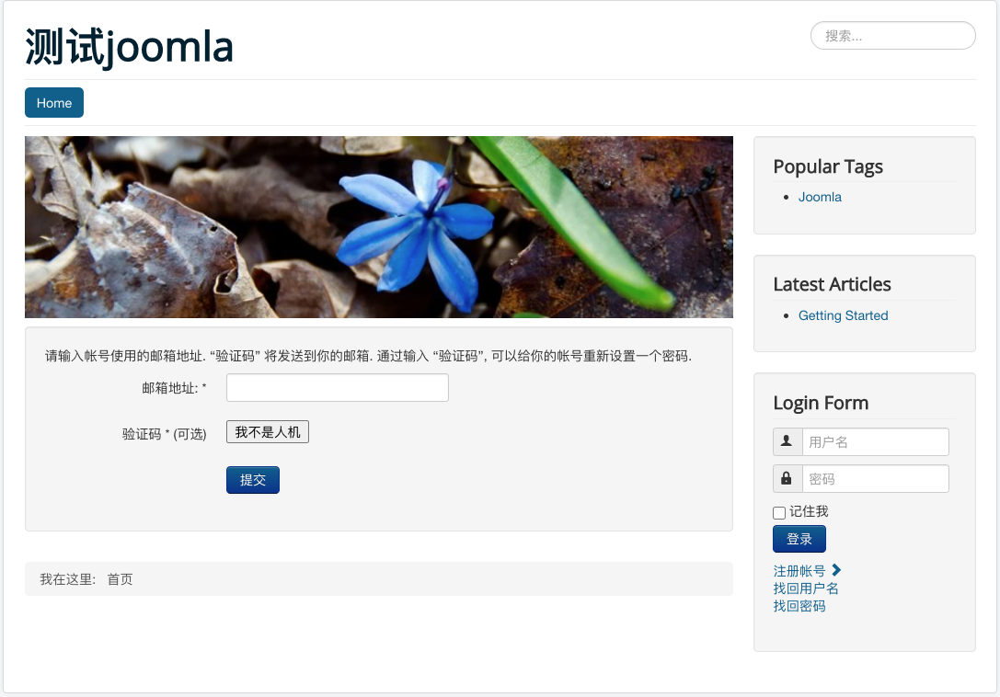

# 腾讯云验证码插件

## 1.插件介绍

> tencentcloud-captcha插件是一款腾讯云研发的，提供给Joomla站长使用的官方插件。实现网站注册、找回密码模块的验证码验证，防止机注册及垃圾邮件。

| 标题       | 名称                                                         |
| ---------- | ------------------------------------------------------------ |
| 中文名称   | 腾讯云验证码（CAPTCHA）插件                                  |
| 英文名称   | tencentcloud-captcha                                         |
| 最新版本   | v1.0.0 (2020.06.23)                                          |
| 适用平台   | [Joomla](https://joomla.org/)                          |
| 适用产品   | [腾讯云验证码](https://cloud.tencent.com/document/product/1110/36334) |
| GitHub项目 | [tencentcloud-joomla-plugin-captcha](https://github.com/Tencent-Cloud-Plugins/tencentcloud-joomla-plugin-captcha) |
| 文档中心   | [春雨文档中心](https://openapp.qq.com/docs/joomla/captcha.html) |
| 主创团队   | 腾讯云中小企业产品中心（SMB Product Center of Tencent Cloud） |

## 2.功能特性

- 支持在注册表单中增加验证码

- 支持找回密码表单增加验证码

## 3.安装指引

### 3.1.部署方式一：通过GitHub部署安装

> 1. 访问[github地址](https://github.com/Tencent-Cloud-Plugins/tencentcloud-joomla-plugin-captcha)，下载zip安装包。
> 2. 访问joomla后台页面：【扩展管理】->【扩展安装】，上传安装包即可。

## 4.使用指引

### 4.1. 页面功能介绍

> 在【扩展管理】->【插件管理】中，选择腾讯云验证码插件，配置插件需要的相关信息及选择状态为启用。  

  
  

> 在【系统管理】->【全局配置】中，选择默认验证码为腾讯云验证码。  

  
  

> 注册页面开启验证码效果。  
 
  
 

> 找回用户名页面开启验证码效果。  
 
  

> 找回密码开启验证码效果。  

### 4.2. 名词解释

- **SecretId**：在腾讯云云平台API密钥上申请的标识身份的 SecretId,用于身份验证。详情参考[腾讯云文档](https://cloud.tencent.com/document/product)。
- **SecretKey**：在腾讯云云平台API密钥上申请的标识身份的SecretId对应的SecretKey，用于身份验证。详情参考[腾讯云文档](https://cloud.tencent.com/document/product)。
- **CaptchaAppId**： 在腾讯云短信验证码控制台应用的应用ID，该应用ID默认应用全部场景。详情参考[腾讯云文档](https://cloud.tencent.com/document/product)。
- **CaptchaAppSecretKey**： 在腾讯云短信验证码控制台应用的密钥，需和应用ID匹配。详情参考[腾讯云文档](https://cloud.tencent.com/document/product)。

## 5.获取入口

| 插件入口          | 链接                                                         |
| ----------------- | ------------------------------------------------------------ |
| GitHub            | [link](https://github.com/Tencent-Cloud-Plugins/tencentcloud-joomla-plugin-captcha) |

## 6.FAQ

## 7.GitHub版本迭代记录

### 7.1 tencentcloud-joomla-plugin-captcha v1.0.0

- 支持在注册表单中增加验证码
- 支持找回用户名表单增加验证码
- 支持找回密码表单增加验证码

本项目由腾讯云中小企业产品中心建设和维护，了解与该插件使用相关的更多信息，请访问[春雨文档中心](https://openapp.qq.com/docs/DiscuzX/sms.html) 

请通过[咨询建议](https://support.qq.com/products/164613) 向我们提交宝贵意见。